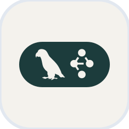
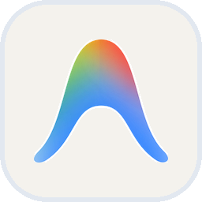

  <h1>Hello there, I'm ducthai.</h1>

   

  <!-- Avatar bo tròn -->
  

  ### 📊 AI & Data Science | Machine Learning Engineer

  

    
    
    
  

  <!-- Auto-typing SVG animation -->
  
  

---

### 👨‍💻 About Me
- 🔭 I’m currently focusing on **Data Science, Machine Learning & LLMs**
- 🤖 Researching & developing **Multi-Agent Systems, Agentic Workflows (MCP) & AI Solutions**
- 🌱 Expanding knowledge in **Data Engineering, Deep Learning & Big Data Architectures**
- 👯 Looking to collaborate on **Data-driven projects, AI Agents & Open Source**
- 💬 Ask me about **Python, SQL, Machine Learning, Data Analytics & AI Workflows**
- 📫 How to reach me: **[ducthai1713@gmail.com](mailto:ducthai1713@gmail.com)**
- ⚡ Fun fact: **"Learn from data!" & 1 + 1 = 2! 📊💡**

---

### 🛠 Skills & Tech Stack

  <!-- Languages & Databases -->
  
  
  
  
  
  
  
  
   
  
  <!-- AI, Machine Learning & Agentic Tools -->
  
  
  
  
  
  
  

---

### 📊 GitHub Stats

  
  
    
  
    
  <!-- Profile visitor counter -->
  

